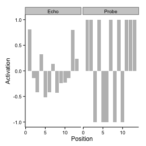
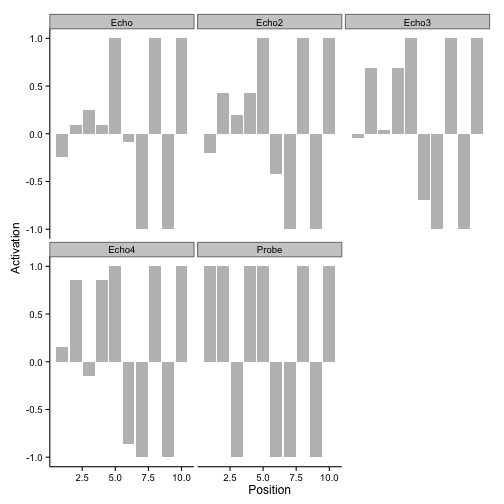
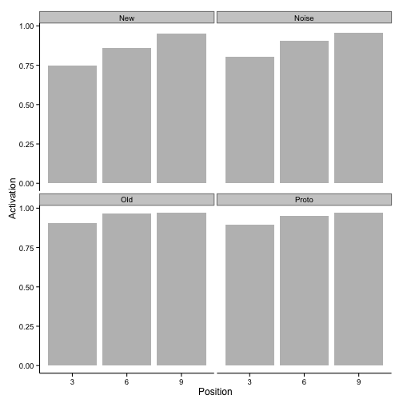

HINTZMAN Replications
---------------------

# 1986 Simulation 1

Each memory trace and each probe was a 23 unit vector. 1-10 represented the category name, and 11-23 represented the stimulus pattern


```r
library(lsa)
```

```
## Loading required package: Snowball
## Loading required package: RWeka
```

```r
library(ggplot2)
getEcho2<-function(probe,mem) {
  simvals<-c()                                              # vector of similarities between probe and memory traces
  for(j in 1:dim(mem)[1]){                                  # Compute Similarities
    simvals[j]<-cosine(probe[1:23],mem[j,1:23])
  }
  echomat<-abs(mem)*(simvals^3)                             # Multiply memory traces by activation value
  echomat[echomat==Inf]<-0                                  # Set any Inf numbers to zero
  echo<-colSums(echomat*sign(mem))      # Sum memory traces, add noise
  echo<-echo/max(abs(echo))                                 # Normalize Echo
  return(echo)
}
```


```r
categoryNames<-rbinom(10*3,1,.5)
CNames<-matrix(categoryNames,ncol=10)
CNames[CNames==0]<--1

Prototypes<-rbinom(13*3,1,.5)
Ptypes<-matrix(Prototypes,ncol=13)
Ptypes[Ptypes==0]<--1

Exemplars<-matrix(ncol=13,nrow=0)
for (j in 1:3){
for(i in 1:10){
  LowDistortion<-sample(seq(11:23),2)
  ones<-rep(1,13)
  ones[LowDistortion]<--1
  temp<-Ptypes[j,]
  Exemplars<-rbind(Exemplars,temp*ones)
}
}
for (j in 1:3){
for(i in 1:10){
  HighDistortion<-sample(seq(11:23),4)
  ones<-rep(1,13)
  ones[HighDistortion]<--1
  temp<-Ptypes[j,]
  Exemplars<-rbind(Exemplars,temp*ones)
}
}

C1<-matrix(ncol=23,nrow=0)
for(i in 31:33)C1<-rbind(C1,c(CNames[1,],Exemplars[i,]))
C2<-matrix(ncol=23,nrow=0)
for(i in 41:46)C2<-rbind(C2,c(CNames[2,],Exemplars[i,]))   
C3<-matrix(ncol=23,nrow=0)
for(i in 51:59)C3<-rbind(C3,c(CNames[3,],Exemplars[i,])) 

Memory<-rbind(C1,C2,C3)
echo<-getEcho2(c(CNames[3,],rep(0,13)),Memory)
cor(Ptypes[3,],echo[11:23])
```

```
## [1] 0.7059536
```

```r
Activations<-c(Ptypes[3,],echo[11:23])
Cue<-rep(c("Probe","Echo"),each=13)
Neuron<-rep(seq(1:13),2)
dframe<-data.frame(Cue,Neuron,Activations)

ggplot(data=dframe, aes(y=Activations,x=Neuron))+
  geom_bar(stat="identity",position=position_dodge(),fill="gray")+
  theme_classic(base_size=12) +
  ylab("Activation") + xlab("Position")+facet_wrap(~Cue)
```

 

The graph above shows a specific comparison between an echo and category prototype. The category prototype was not stored in memory, instead memory included 9 high distortion exemplars (4 units in each were sign reversed). The memory model was probed wih the category name, and the resultant echo clearly resembles the prototype from which the exemplars were created.

Hintzman next demonstrates that the correlations between echo and prototype vary as a function of the number of exemplars stored in memory


```r
#category 1 with 3 exemplars
echo<-getEcho2(c(CNames[1,],rep(0,13)),Memory)
cor(Ptypes[1,],echo[11:23])
```

```
## [1] 0.6374906
```

```r
#Category 2 with 6 exemplars
echo<-getEcho2(c(CNames[2,],rep(0,13)),Memory)
cor(Ptypes[2,],echo[11:23])
```

```
## [1] 0.7111418
```

```r
#Category 3 with 9 exemplars
echo<-getEcho2(c(CNames[3,],rep(0,13)),Memory)
cor(Ptypes[3,],echo[11:23])
```

```
## [1] 0.7059536
```

The above correlations and simulation reflect a single simulated subject, as such the trends shown in the correlations will vary for each simulation. Hintzman reported these correlations for 20 simualted subjects


```r
C1cor<-c()
C2cor<-c()
C3cor<-c()
#Run 20 simulated subject
for(sub in 1:20){
categoryNames<-rbinom(10*3,1,.5)
CNames<-matrix(categoryNames,ncol=10)
CNames[CNames==0]<--1

Prototypes<-rbinom(13*3,1,.5)
Ptypes<-matrix(Prototypes,ncol=13)
Ptypes[Ptypes==0]<--1

Exemplars<-matrix(ncol=13,nrow=0)
for (j in 1:3){
for(i in 1:10){
  LowDistortion<-sample(seq(11:23),2)
  ones<-rep(1,13)
  ones[LowDistortion]<--1
  temp<-Ptypes[j,]
  Exemplars<-rbind(Exemplars,temp*ones)
}
}
for (j in 1:3){
for(i in 1:10){
  HighDistortion<-sample(seq(11:23),4)
  ones<-rep(1,13)
  ones[HighDistortion]<--1
  temp<-Ptypes[j,]
  Exemplars<-rbind(Exemplars,temp*ones)
}
}

C1<-matrix(ncol=23,nrow=0)
for(i in 31:33)C1<-rbind(C1,c(CNames[1,],Exemplars[i,]))
C2<-matrix(ncol=23,nrow=0)
for(i in 41:46)C2<-rbind(C2,c(CNames[2,],Exemplars[i,]))   
C3<-matrix(ncol=23,nrow=0)
for(i in 51:59)C3<-rbind(C3,c(CNames[3,],Exemplars[i,])) 

Memory<-rbind(C1,C2,C3)
#category 1 with 3 exemplars
echo<-getEcho2(c(CNames[1,],rep(0,13)),Memory)
C1cor<-c(C1cor,cor(Ptypes[1,],echo[11:23]))
#Category 2 with 6 exemplars
echo<-getEcho2(c(CNames[2,],rep(0,13)),Memory)
C2cor<-c(C2cor,cor(Ptypes[2,],echo[11:23]))
#Category 3 with 9 exemplars
echo<-getEcho2(c(CNames[3,],rep(0,13)),Memory)
C3cor<-c(C3cor,cor(Ptypes[3,],echo[11:23]))
}
mean(C1cor)
```

```
## [1] 0.5682495
```

```r
mean(C2cor)
```

```
## [1] 0.7358566
```

```r
mean(C3cor)
```

```
## [1] 0.781
```

# Simulating ambiguous recall

The previous simulations used the category name as a probe, and showed that the echo resembles the prototypes used to construct the exemplars. A related question is whether probing the memory with the prototype will retrieve the correct category name


```r
C1cor<-c()
C2cor<-c()
C3cor<-c()
#Run 20 simulated subject
for(sub in 1:20){
categoryNames<-rbinom(10*3,1,.5)
CNames<-matrix(categoryNames,ncol=10)
CNames[CNames==0]<--1

Prototypes<-rbinom(13*3,1,.5)
Ptypes<-matrix(Prototypes,ncol=13)
Ptypes[Ptypes==0]<--1

Exemplars<-matrix(ncol=13,nrow=0)
for (j in 1:3){
for(i in 1:10){
  LowDistortion<-sample(seq(11:23),2)
  ones<-rep(1,13)
  ones[LowDistortion]<--1
  temp<-Ptypes[j,]
  Exemplars<-rbind(Exemplars,temp*ones)
}
}
for (j in 1:3){
for(i in 1:10){
  HighDistortion<-sample(seq(11:23),4)
  ones<-rep(1,13)
  ones[HighDistortion]<--1
  temp<-Ptypes[j,]
  Exemplars<-rbind(Exemplars,temp*ones)
}
}

C1<-matrix(ncol=23,nrow=0)
for(i in 31:33)C1<-rbind(C1,c(CNames[1,],Exemplars[i,]))
C2<-matrix(ncol=23,nrow=0)
for(i in 41:46)C2<-rbind(C2,c(CNames[2,],Exemplars[i,]))   
C3<-matrix(ncol=23,nrow=0)
for(i in 51:59)C3<-rbind(C3,c(CNames[3,],Exemplars[i,])) 

Memory<-rbind(C1,C2,C3)
#category 1 with 3 exemplars
echo<-getEcho2(c(rep(0,10),Ptypes[1,]),Memory)
C1cor<-c(C1cor,cor(CNames[1,],echo[1:10]))
#Category 2 with 6 exemplars
echo<-getEcho2(c(rep(0,10),Ptypes[2,]),Memory)
C2cor<-c(C2cor,cor(CNames[2,],echo[1:10]))
#Category 3 with 9 exemplars
echo<-getEcho2(c(rep(0,10),Ptypes[3,]),Memory)
C3cor<-c(C3cor,cor(CNames[3,],echo[1:10]))
}
mean(C1cor)
```

```
## [1] 0.6033374
```

```r
mean(C2cor)
```

```
## [1] 0.7547756
```

```r
mean(C3cor)
```

```
## [1] 0.9182734
```

# deblurring the echo

Hintzman shows that resubmitting an echo to memory as the probe can result in a new echo that is more similar to the prototype than the previous echo. This operation is termed deblurring.


```r
C3cor<-c()
C3bcor<-c()
C3ccor<-c()
C3dcor<-c()
#Run 20 simulated subject
for(sub in 1:1){
categoryNames<-rbinom(10*3,1,.5)
CNames<-matrix(categoryNames,ncol=10)
CNames[CNames==0]<--1

Prototypes<-rbinom(13*3,1,.5)
Ptypes<-matrix(Prototypes,ncol=13)
Ptypes[Ptypes==0]<--1

Exemplars<-matrix(ncol=13,nrow=0)
for (j in 1:3){
for(i in 1:10){
  LowDistortion<-sample(seq(11:23),2)
  ones<-rep(1,13)
  ones[LowDistortion]<--1
  temp<-Ptypes[j,]
  Exemplars<-rbind(Exemplars,temp*ones)
}
}
for (j in 1:3){
for(i in 1:10){
  HighDistortion<-sample(seq(11:23),4)
  ones<-rep(1,13)
  ones[HighDistortion]<--1
  temp<-Ptypes[j,]
  Exemplars<-rbind(Exemplars,temp*ones)
}
}

C1<-matrix(ncol=23,nrow=0)
for(i in 31:33)C1<-rbind(C1,c(CNames[1,],Exemplars[i,]))
C2<-matrix(ncol=23,nrow=0)
for(i in 41:46)C2<-rbind(C2,c(CNames[2,],Exemplars[i,]))   
C3<-matrix(ncol=23,nrow=0)
for(i in 51:59)C3<-rbind(C3,c(CNames[3,],Exemplars[i,])) 

Memory<-rbind(C1,C2,C3)
#Category 3 with 9 exemplars
echo<-getEcho2(c(rep(0,10),Ptypes[3,]),Memory)
C3cor<-c(C3cor,cor(CNames[3,],echo[1:10]))
echo2<-getEcho2(echo/max(abs(echo)),Memory)
C3bcor<-c(C3bcor,cor(CNames[3,],echo2[1:10]))
echo3<-getEcho2(echo2/max(abs(echo2)),Memory)
C3ccor<-c(C3ccor,cor(CNames[3,],echo3[1:10]))
echo4<-getEcho2(echo3/max(abs(echo3)),Memory)
C3dcor<-c(C3ccor,cor(CNames[3,],echo4[1:10]))
}

mean(C3cor)
```

```
## [1] 0.6566325
```

```r
mean(C3bcor)
```

```
## [1] 0.7754676
```

```r
mean(C3ccor)
```

```
## [1] 0.8659746
```

```r
mean(C3dcor)
```

```
## [1] 0.8936038
```

```r
Activations<-c(CNames[3,],echo[1:10],echo2[1:10],echo3[1:10],echo4[1:10])
Cue<-rep(c("Probe","Echo","Echo2","Echo3","Echo4"),each=10)
Neuron<-rep(seq(1:10),5)
dframe<-data.frame(Cue,Neuron,Activations)

ggplot(data=dframe, aes(y=Activations,x=Neuron))+
  geom_bar(stat="identity",position=position_dodge(),fill="gray")+
  theme_classic(base_size=12) +
  ylab("Activation") + xlab("Position")+facet_wrap(~Cue)
```

 

# Hintzman's Basic findings

Directly from the paper:

To evaluate the model's performance on the schema-abstrac-tion task, 3, 6, and 9 high-level distortions of three prototypes were generated, respectively, and each was paired with the ap- propriate category name and encoded in SM as described earlier, for a total of 18 SM traces. Classification testing was carried out using one probe per category representing each of the fol- lowing conditions: (a) an old exemplar (one that was originally stored in SM), (b) the category prototype, (c) a new low-level distortion of the prototype, (d) a new high-level distortion of the prototype, and (e) a random pattern. A forgetting cycle fol- lowed, during which each feature stored in SM--that is, each T(i, j)--either remained the same with Pr ffi .25 or reverted to zero with Pr = .75. Then testing was done again in the same way. Three hundred subjects were simulated by repeating the entire procedure, from the generation of new prototypes and names through the final test, 300 times.

# note simulation incomplete


```r
C1Old<-c()
C2Old<-c()
C3Old<-c()
C1P<-c()
C2P<-c()
C3P<-c()
C1Pd<-c()
C2Pd<-c()
C3Pd<-c()
C1n<-c()
C2n<-c()
C3n<-c()
#Run 20 simulated subject
for(sub in 1:10){
categoryNames<-rbinom(10*3,1,.5)
CNames<-matrix(categoryNames,ncol=10)
CNames[CNames==0]<--1

Prototypes<-rbinom(13*3,1,.5)
Ptypes<-matrix(Prototypes,ncol=13)
Ptypes[Ptypes==0]<--1

Exemplars<-matrix(ncol=13,nrow=0)
#Create unique sampling distortions
SamplingDistortion<-matrix(ncol=4,nrow=0)
for(i in 1:50){
SamplingDistortion<-rbind(SamplingDistortion,sort(sample(seq(11:23),4,replace=F)))
}
SamplingDistortion<-unique(SamplingDistortion)
a<-0
for (j in 1:3){
for(i in 1:10){
  a<-a+1
  ones<-rep(1,13)
  ones[SamplingDistortion[a,]]<--1
  temp<-Ptypes[j,]
  Exemplars<-rbind(Exemplars,temp*ones)
}
}

C1<-matrix(ncol=23,nrow=0)
for(i in 1:3)C1<-rbind(C1,c(CNames[1,],Exemplars[i,]))
C2<-matrix(ncol=23,nrow=0)
for(i in 11:16)C2<-rbind(C2,c(CNames[2,],Exemplars[i,]))   
C3<-matrix(ncol=23,nrow=0)
for(i in 21:29)C3<-rbind(C3,c(CNames[3,],Exemplars[i,])) 

Memory<-rbind(C1,C2,C3)

#test old exemplar
echo<-getEcho2(c(rep(0,10),Exemplars[1,]),Memory)
C1Old<-c(C1Old,cor(echo[1:10],CNames[1,]))
echo<-getEcho2(c(rep(0,10),Exemplars[11,]),Memory)
C2Old<-c(C2Old,cor(echo[1:10],CNames[2,]))
echo<-getEcho2(c(rep(0,10),Exemplars[21,]),Memory)
C3Old<-c(C3Old,cor(echo[1:10],CNames[3,]))
#test Category Prototype
echo<-getEcho2(c(rep(0,10),Ptypes[1,]),Memory)
C1P<-c(C1Old,cor(echo[1:10],CNames[1,]))
echo<-getEcho2(c(rep(0,10),Ptypes[2,]),Memory)
C2P<-c(C2Old,cor(echo[1:10],CNames[2,]))
echo<-getEcho2(c(rep(0,10),Ptypes[3,]),Memory)
C3P<-c(C3Old,cor(echo[1:10],CNames[3,]))
#test Category Prototype new distorted (new exemplar)
echo<-getEcho2(c(rep(0,10),Exemplars[10,]),Memory)
C1Pd<-c(C1Old,cor(echo[1:10],CNames[1,]))
echo<-getEcho2(c(rep(0,10),Exemplars[20,]),Memory)
C2Pd<-c(C2Old,cor(echo[1:10],CNames[2,]))
echo<-getEcho2(c(rep(0,10),Exemplars[30,]),Memory)
C3Pd<-c(C3Old,cor(echo[1:10],CNames[3,]))
#test noise
noiseTest<-rbinom(13,1,.5)
noiseTest[noiseTest==0]<--1
echo<-getEcho2(c(rep(0,10),noiseTest),Memory)
C1n<-c(C1Old,cor(echo[1:10],CNames[1,]))
echo<-getEcho2(c(rep(0,10),noiseTest),Memory)
C2n<-c(C2Old,cor(echo[1:10],CNames[2,]))
echo<-getEcho2(c(rep(0,10),noiseTest),Memory)
C3n<-c(C3Old,cor(echo[1:10],CNames[3,]))

}

Similarities<-c(mean(C1Old),mean(C2Old),mean(C3Old),
mean(C1P),mean(C2P),mean(C3P),
mean(C1Pd),mean(C2Pd),mean(C3Pd),
mean(C1n),mean(C2n),mean(C3n))
NumStored<-rep(c("3","6","9"),4)
Probe<-rep(c("Old","Proto","New","Noise"),each=3)

dframe<-data.frame(Similarities,NumStored,Probe)

ggplot(data=dframe, aes(y=Similarities,x=NumStored))+
  geom_bar(stat="identity",position=position_dodge(),fill="gray")+
  theme_classic(base_size=12) +
  ylab("Activation") + xlab("Position")+facet_wrap(~Probe)
```

 
