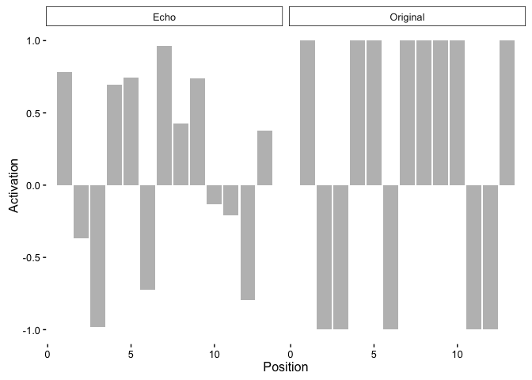

# Hintzman 1986
Matt Crump  
August 30, 2016  

# 1986 Simulation 1: Abstraction

Load libraries


```
## Loading required package: SnowballC
```

Each memory trace and each probe was a 23 unit vector. 

Units 1-10 represented the category name, and 11-23 represented the stimulus pattern. Each unit had a .5 probability of being assigned a +1 (activated unit) or a -1 (inhibited unit).

Three category names and prototypes were used in the simulations.

## Construct three category names and prototype patterns

Create a 3 (rows) x 23 (columns) matrix, with each unit assigned 1 or -1 with p=.5

Use the following functions

- runif(n,min,max) - samples n times from a uniform distribution between min and max
- sign() - converts digits to 1 or -1
- matrix(vector,nrow,ncol) converts vector to a matrix


```r
categories_prototypes <- matrix(sign(runif(3*23,-1,1)),nrow=3,ncol=23)
```

## Create distortions of the prototype pattern

Distortions of each prototype pattern (exemplars of a category) were generated by randomly selecting two (low distortion) or four (high distortion) units from each prototype and flipping their sign (multiply by -1). 


```r
# create empty matrix with room for 3, 6, and 9 exemplars from each category
distorted_exemplars <- matrix(nrow = 18, ncol = 23)  
i <- 0  
number_of_distortions <- c(3, 6, 9)
for (m in 1:3) {
  for (mm in 1:number_of_distortions[m]){
    i <- i + 1
    #create distortion vector
    distortion_vector <- rep(1, 23)
    distortion_vector[sample(seq(11, 23), 2)] <- -1  
    # multiply distortion and prototype and save in matrix
    distorted_exemplars[i, ] <- distortion_vector * categories_prototypes[m, ]  
  }
}
```

## Function to get an echo from a memory

MINERVA compares a probe pattern to all stored exemplars in memory. Each exemplar is weighted by it's similarity to the probe. The weighted vectors are summed into the echo.


```r
# probe is the input vector, mem is the matrix of exemplars
# requires LSA package for cosine 
# (may not be exactly the same similarity function as Hintzman 1986)

get_echo <- function(probe, mem) {
    # compute similarities between probe and memories
    sim_vals <- c()
    for (m in 1:dim(mem)[1]) {
        sim_vals[m] <- cosine(probe, mem[m, ])  
    }
    # Weight memories by similarity
    weighted_memory <- mem * (sim_vals^3)  
    summed_echo <- colSums(weighted_memory)
    return(summed_echo)
}
```

## Probe with Category Name


```r
# probe memory, return echo, correlate echo against original prototype
current_probe <- c(categories_prototypes[1, 1:10], rep(0, 13))
echo <- get_echo(current_probe, distorted_exemplars)
cor(echo[11:23], categories_prototypes[1, 11:23])
```

```
## [1] 0.8580136
```

```r
# plot the echo and the original
activations <- c(categories_prototypes[1,11:23], echo[11:23])
cue <- rep(c("Original", "Echo"), each=13)
neuron_unit <- rep(seq(1:13) ,2)
dframe <- data.frame(cue, neuron_unit, activations)

ggplot(data=dframe, aes(y=activations, x=neuron_unit))+
  geom_bar(stat="identity", position = position_dodge(), fill = "gray") +
  theme_classic(base_size = 12) +
  ylab("Activation") +
  xlab("Position") + 
  facet_wrap(~cue)
```

<!-- -->

## Running multiple simulated Subjects

Each simulated subject is shown 3, 6 and 9 exemplars across three categories. Each of the category names is probed, and the retrieved echo pattern is compared to the prototype pattern. The correlation between the retrieved pattern and the original prototype should increase with the number of exemplars in memory. Category 1 has 3 exemplars, Category2 has 6 exemplars, and Category 3 has 9 exemplars.


```r
# loop for each subject
simulation_df <- data.frame()
for(subs in 1:20){
  
  # original category and prototype patterns
  categories_prototypes <- matrix(sign(runif(3*23, -1, 1)), nrow=3, ncol=23)
  
  # 3, 6, and 9 distortions
  distorted_exemplars <- matrix(nrow = 18, ncol = 23)  
  i <- 0  
  number_of_distortions <- c(3, 6, 9)
  for (m in 1:3) {
    for (mm in 1:number_of_distortions[m]){
      i <- i + 1
      #create distortion vector
      distortion_vector <- rep(1, 23)
      distortion_vector[sample(seq(11, 23), 2)] <- -1  
      # multiply distortion and prototype and save in matrix
      distorted_exemplars[i, ] <- distortion_vector * categories_prototypes[m, ]  
    }
  }
  
  #test each category label
  save_correlation <- c()
  for (category_label in 1:3){
    current_probe <- c(categories_prototypes[category_label, 1:10], rep(0, 13))
    echo <- get_echo(current_probe, distorted_exemplars)
    save_correlation <- c(save_correlation,
                          cor(echo[11:23], categories_prototypes[category_label, 11:23]))
  }
  
  store_data <- data.frame(subject = rep(subs, 3),
                           category = seq(1, 3),
                           correlation = save_correlation)
  
  simulation_df <- rbind(simulation_df, store_data)
}

# show the data in a table
summary_df <- ddply(simulation_df,.(category),summarise, cor=mean(correlation), se=stde(correlation))
kable(xtable(summary_df),format="markdown")
```


| category|       cor|        se|
|--------:|---------:|---------:|
|        1| 0.7985484| 0.0439799|
|        2| 0.9175562| 0.0089125|
|        3| 0.9463933| 0.0057922|


