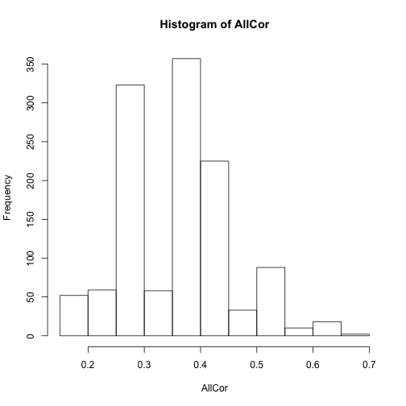
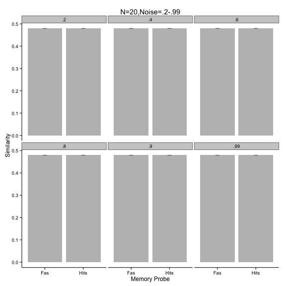

MINERVA DISCREPANCY ENCODING
----------------------------

The model requires this package and function

```r
library(lsa)
```

```
## Loading required package: Snowball
## Loading required package: RWeka
```

```r
library(ggplot2)
library(Crump)
getEcho2<-function(probe,mem) {
  simvals<-c()                                              # vector of similarities between probe and memory traces
  for(j in 1:dim(mem)[1]){                                  # Compute Similarities
    simvals[j]<-cosine(probe[1:50],mem[j,1:50])
  }
  echomat<-abs(mem)*(simvals^3)                             # Multiply memory traces by activation value
  echomat[echomat==Inf]<-0                                  # Set any Inf numbers to zero
  echo<-colSums(echomat*sign(mem))+runif(50,-.01,.01)      # Sum memory traces, add noise
  echo<-echo/max(abs(echo))                                 # Normalize Echo
  return(echo)
}
```


# Pre-experimental familiarity problem, no discrepancy encoding

How does MINERVA distinguish between items presented in the encoding phase, and known (pre-experimentally familiar) items. The problem is modeled by created a memory of 100 cues to establish pre-experimental familiarity. 50 cues are represented to the memory during encoding, then, all 100 cues are tested.


```r
Single<-c()
New<-c()
NoiseP<-c(.2,.4,.6,.8,.9,.99)
for(NP in NoiseP){
NumSimulatedSubs<-10
for(subs in 1:NumSimulatedSubs){
BackgroundMemory<-rbinom(50*100,1,.5)
BM<-matrix(BackgroundMemory,ncol=50)
#BM[BM==0]<--1

EncodingProbability<-NP
PresentedWords<-BM
for(i in 1:50)PresentedWords<-rbind(PresentedWords,BM[i,]*rbinom(50,1,EncodingProbability))

sims<-c()
for(i in 1:100)sims<-c(sims,getEcho2(BM[i,],PresentedWords)%*%BM[i,]/50)

Single<-c(Single,mean(sims[1:50]))
New<-c(New,mean(sims[51:100]))
}
}

#Create dataframe
Similarity<-c(Single,New)
Subjects<-rep(rep(1:NumSimulatedSubs),2*6)
ItemType<-rep(c("Single","New"),each=NumSimulatedSubs*6)
Noise<-rep(c(".2",".4",".6",".8",".9",".99"),each=NumSimulatedSubs)
DfAllMeans<-data.frame(Subjects,ItemType,Similarity,Noise)

#create a graph
DfAllMeans2<-aggregate(Similarity~ItemType*Noise,DfAllMeans,mean)
DfAllMeans3<-aggregate(Similarity~ItemType*Noise,DfAllMeans,stde)
DfAllMeans2<-data.frame(DfAllMeans2,SE=DfAllMeans3$Similarity)

limits<-aes(ymax = DfAllMeans2$Similarity + DfAllMeans2$SE,ymin= DfAllMeans2$Similarity - DfAllMeans2$SE)
ggplot(data=DfAllMeans2, aes(y=Similarity,x=ItemType))+
  geom_bar(stat="identity",position=position_dodge(),fill="gray")+
  geom_errorbar(limits,width=.1, size=.2,color="black", position=position_dodge(.9)) +
  theme_classic(base_size=12) +
  ylab("Similarity") + xlab("Memory Probe")+ggtitle("N=20,Noise=.2-.99")+facet_wrap(~Noise)
```

 

# Pre-experimental familiarity problem, no discrepancy encoding
# With hits and false alarms

How does MINERVA distinguish between items presented in the encoding phase, and known (pre-experimentally familiar) items. The problem is modeled by creating a memory of 100 cues to establish pre-experimental familiarity. 50 cues are represented to the memory during encoding, then, all 100 cues are tested.


```r
HitRate<-c()
FaRate<-c()
Single<-c()
New<-c()
NoiseP<-c(.2,.4,.6,.8,.9,.99)
for(NP in NoiseP){
NumSimulatedSubs<-10
for(subs in 1:NumSimulatedSubs){
BackgroundMemory<-rbinom(50*100,1,.5)
BM<-matrix(BackgroundMemory,ncol=50)
#BM[BM==0]<--1

EncodingProbability<-NP
PresentedWords<-BM
for(j in 1:5)PresentedWords<-rbind(PresentedWords)#strengthen pre-experimental familiarity
for(i in 1:50)PresentedWords<-rbind(PresentedWords,BM[i,]*rbinom(50,1,EncodingProbability))

sims<-c()
for(i in 1:100)sims<-c(sims,getEcho2(BM[i,],PresentedWords)%*%BM[i,]/50)

Single<-mean(sims[1:50])
New<-mean(sims[51:100])
Criterion=mean(Single,New)

hits<-c()
hits<-(sims[1:50]>Criterion)*1
fas<-c()
fas<-(sims[51:100]>Criterion)*1
HitRate<-c(HitRate,sum(hits)/50)
FaRate<-c(FaRate,sum(fas)/50)
}
}
```

```
## Error in if (trim > 0 && n) {: missing value where TRUE/FALSE needed
```

```r
#Create dataframe
Performance<-c(HitRate,FaRate)
Subjects<-rep(rep(1:NumSimulatedSubs),2*6)
Rates<-rep(c("Hits","Fas"),each=NumSimulatedSubs*6)
Noise<-rep(c(".2",".4",".6",".8",".9",".99"),each=NumSimulatedSubs,2)
DfAllMeans<-data.frame(Subjects,Rates,Performance,Noise)

#create a graph
DfAllMeans2<-aggregate(Performance~Rates*Noise,DfAllMeans,mean)
DfAllMeans3<-aggregate(Performance~Rates*Noise,DfAllMeans,stde)
DfAllMeans2<-data.frame(DfAllMeans2,SE=DfAllMeans3$Performance)

limits<-aes(ymax = DfAllMeans2$Performance + DfAllMeans2$SE,ymin= DfAllMeans2$Performance - DfAllMeans2$SE)
ggplot(data=DfAllMeans2, aes(y=Performance,x=Rates))+
  geom_bar(stat="identity",position=position_dodge(),fill="gray")+
  geom_errorbar(limits,width=.1, size=.2,color="black", position=position_dodge(.9)) +
  theme_classic(base_size=12) +
  ylab("Similarity") + xlab("Memory Probe")+ggtitle("N=20,Noise=.2-.99")+facet_wrap(~Noise)
```

 

