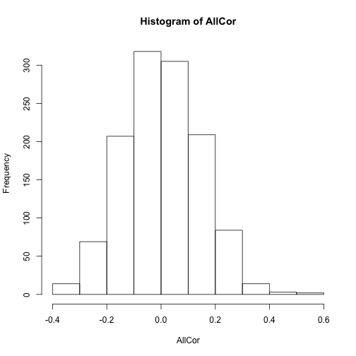
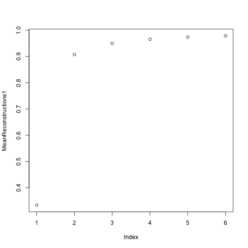
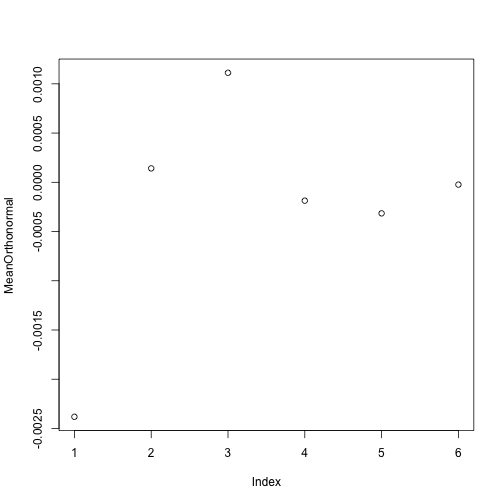
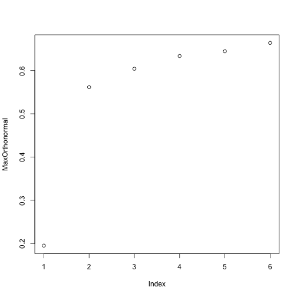

MINERVA monte carlo simulations 2
---------------------

First set of simulations show that a random set of memory items can be used to closely reconstruct any random item, however this ability likely depends on having a critical number of memory items, where the critical number may be defined as some proportion of the total number of possible patterns in the set. 

The present simulation looks at process assumptions that may increase the fidelity of probe reconstruction

## Iteratively storing the echo during reconstruction

### Generate a matrix of unique random vectors.

Each element of the vector is assigned a 1 or -1.


```r
VectorLength=20
NumberOfVectors=1000
GenerateVectors<-c(rep(1,VectorLength),rep(0,VectorLength))
GenerateVectors=c(GenerateVectors,rbinom(VectorLength*NumberOfVectors,1,.5))
PatternMatrix<-matrix(GenerateVectors,nrow=NumberOfVectors+2,byrow=TRUE)
PatternMatrix[PatternMatrix==0]=-1
PatternMatrix<-unique.matrix(PatternMatrix)
SizePatternM<-dim(PatternMatrix)
```

### Store echo in memory set

The simulation determines whether there is a benefit to probe reconstruction gained by storing the echo in the memory set. This simulation stores the echo a single time.


```r
library(lsa)
```

```
## Loading required package: Snowball
## Loading required package: RWeka
```

```r
library(ggplot2)
getEcho2<-function(probe,mem) {
  simvals<-c()                                              # vector of similarities between probe and memory traces
  for(j in 1:dim(mem)[1]){                                  # Compute Similarities
    simvals[j]<-cosine(probe[1:VectorLength],mem[j,1:VectorLength])
  }
  echomat<-abs(mem)*(simvals^3)                             # Multiply memory traces by activation value
  echomat[echomat==Inf]<-0                                  # Set any Inf numbers to zero
  echo<-colSums(echomat*sign(mem))      # Sum memory traces, add noise
  #echo<-colSums(echomat)
  echo<-echo/max(abs(echo))                                 # Normalize Echo
  return(echo)
}
```

```r
MeanReconstructions<-c() #Stores mean similarity of probe to Memset across monte carlo simulation
MeanReconstructions1<-c()
MeanOrthonormal<-c()
MaxOrthonormal<-c()
for (k in seq(3,503,100)){
Reconstruction<-c() #stores individual similarity scores within monte carlo simulation
Reconstruction1<-c()
MeanProbeAverageSimToSet<-c()
MaxProbeAverageSimToSet<-c()
for(j in 1:500){
SamplePatterns<-sample(seq(from=3, to=SizePatternM[1], by=1),(k+1))
MemoryProbe<-PatternMatrix[SamplePatterns[1],]
MemorySet<-c()
for(i in seq(2,(k+1))) MemorySet<-rbind(MemorySet,PatternMatrix[SamplePatterns[i],])
MemorySet<-matrix(MemorySet,ncol=VectorLength,nrow=(k),byrow=TRUE)
Echo1<-getEcho2(MemoryProbe,MemorySet)
Reconstruction<-c(Reconstruction,cor(MemoryProbe,Echo1))
MemorySet<-rbind(MemorySet,Echo1)
Reconstruction1<-c(Reconstruction1,cor(MemoryProbe,getEcho2(MemoryProbe,MemorySet)))

#Sanity Checks
##Establish orthonormal expectation
ProbeAverageSimToSet<-c() #Stores individual correlations
for(p in 1:k) ProbeAverageSimToSet<-c(ProbeAverageSimToSet,cor(MemoryProbe,MemorySet[p,]))
MeanProbeAverageSimToSet<-c(MeanProbeAverageSimToSet,mean(ProbeAverageSimToSet))
##Measure max similarity from any item in memory to probe
MaxProbeAverageSimToSet<-c(MaxProbeAverageSimToSet,max(ProbeAverageSimToSet))
}

#Summary vectors for each step of the Monte Carlo Simulation

MeanReconstructions<-c(MeanReconstructions,mean(Reconstruction,na.rm=TRUE))
MeanReconstructions1<-c(MeanReconstructions1,mean(Reconstruction1,na.rm=TRUE))
MeanOrthonormal<-c(MeanOrthonormal,mean(MeanProbeAverageSimToSet,na.rm=TRUE))
MaxOrthonormal<-c(MaxOrthonormal,mean(MaxProbeAverageSimToSet,na.rm=TRUE))
}
```

```
## Warning in cor(MemoryProbe, MemorySet[p, ]): the standard deviation is
## zero
```

The plot below shows the mean similarity between the probe and the echo for each step of the monte-carlo simulation. The y-axis shows mean similarity, calculated as the correlation between the the probe and the echo. The x-axis shows each step of the monte-carlo simulation that increases the set-size of items in memory. All of the probes were not in the memory set. All of the items in the memory set were uniquely generated random vectors. Thus, there is an expectation of orthonormality between the all vectors in each simulation. The result clearly shows that the ability of the randomly generated memory set to reconstruct a randomly generated probe grows as a function of memory set-size. This result implies that randomly generated memory sets restricted in size to contain many patterns less than the total number of possible patterns, can on average, closely approximate reconstructions of the remaining patterns not contained in the memory set.


```r
plot(MeanReconstructions)
```

 

```r
plot(MeanReconstructions1)
```

 

The plot below is a sanity check to verify each probe was orthonormal in expectation to each of the items in the memory set. For each simulation, the probe was correlated with each of the items in the memory, and the average correlation was across items was stored for each simulation. Each point reflects the means of these averages for each step of the simulation. If the probe is orthonormal in expectation, then the average correlations should be zero on average. The graph shows this to be the case.


```r
plot(MeanOrthonormal)
```

 

Although each of the vectors are unique and randomly generated, and therefore have an expectation or orthonormality, random variation will cause some memory items to be more correlated to the probe than others. As part of the above analysis, the memory item with the maximum similarity to the probe on each simulation was stored. The plot shows the means of the max correlations between single items in the memory set and the probe. The results, not surprisingly, show that as the memory set-size increases it will contain at least one item with an increasingly higher correlation value to the probe.


```r
plot(MaxOrthonormal)
```

 
