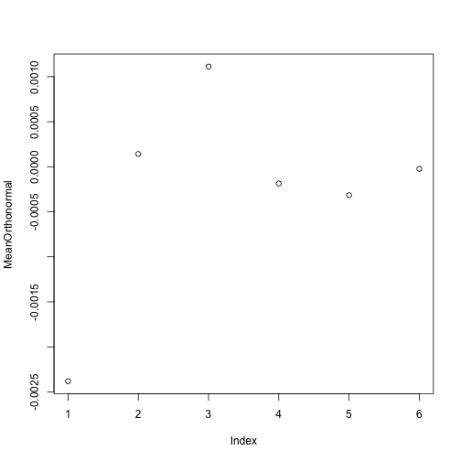
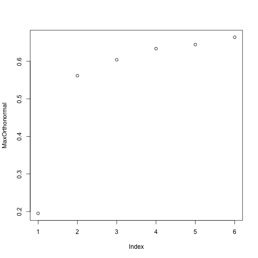

MINERVA monte carlo simulations
---------------------

MINERVA stores individual memories as vectors in a memory matrix. Recall is achieved by submitted a probe vector to memory, calculating the similarity of the probe to all vectors in memory, weighting each memory item by it's similarity value, and then composing a memory response, or echo, that is the sum of the retrieved items weighted by their similarity. If the probe is contained in the memory set, it is always possible to retrieve that memory item by increasing the exponent used to weight each item by it's similarity value. Otherwise, the memory will approximate the probe by relying on the ganged retrieval of a collection of similar items. 

The following simluations explore some of the mathematical foundations of the MINERVA model. Memory sets of various sizes are generated. The memory items are generated from the set of possible patterns that the vector representation allows. These memory sets are probed with new patterns that are not in the memory set. The goal is to describe novel probe-reconstruction quality as a function of the number of orthonormal vectors in the memory set. 

### Generate a matrix of unique random vectors.

Each element of the vector is assigned a 1 or 0.


```r
VectorLength=20
NumberOfVectors=1000
GenerateVectors<-c(rep(1,VectorLength),rep(0,VectorLength))
GenerateVectors=c(GenerateVectors,rbinom(VectorLength*NumberOfVectors,1,.5))
PatternMatrix<-matrix(GenerateVectors,nrow=NumberOfVectors+2,byrow=TRUE)
PatternMatrix[PatternMatrix==0]=-1
PatternMatrix<-unique.matrix(PatternMatrix)
SizePatternM<-dim(PatternMatrix)
```

### Run monte carlo

Memory set increases with each simulation. All items are unique random vectors. The probe item is a unique random vector that is not in the memory set. Correlations between the probe and echo are taken as a measure of the ability of the memory set to reconstruct the probe.


```r
library(lsa)
```

```
## Loading required package: Snowball
## Loading required package: RWeka
```

```r
library(ggplot2)
getEcho2<-function(probe,mem) {
  simvals<-c()                                              # vector of similarities between probe and memory traces
  for(j in 1:dim(mem)[1]){                                  # Compute Similarities
    simvals[j]<-cosine(probe[1:VectorLength],mem[j,1:VectorLength])
  }
  echomat<-abs(mem)*(simvals^3)                             # Multiply memory traces by activation value
  echomat[echomat==Inf]<-0                                  # Set any Inf numbers to zero
  echo<-colSums(echomat*sign(mem))      # Sum memory traces, add noise
  #echo<-colSums(echomat)
  echo<-echo/max(abs(echo))                                 # Normalize Echo
  return(echo)
}
```

```r
MeanReconstructions<-c() #Stores mean similarity of probe to Memset across monte carlo simulation
MeanOrthonormal<-c()
MaxOrthonormal<-c()
for (k in seq(3,503,100)){
Reconstruction<-c() #stores individual similarity scores within monte carlo simulation
MeanProbeAverageSimToSet<-c()
MaxProbeAverageSimToSet<-c()
for(j in 1:500){
SamplePatterns<-sample(seq(from=3, to=SizePatternM[1], by=1),(k+1))
MemoryProbe<-PatternMatrix[SamplePatterns[1],]
MemorySet<-c()
for(i in seq(2,(k+1))) MemorySet<-rbind(MemorySet,PatternMatrix[SamplePatterns[i],])
MemorySet<-matrix(MemorySet,ncol=VectorLength,nrow=(k),byrow=TRUE)
Reconstruction<-c(Reconstruction,cor(MemoryProbe,getEcho2(MemoryProbe,MemorySet)))

#Sanity Checks
##Establish orthonormal expectation
ProbeAverageSimToSet<-c() #Stores individual correlations
for(p in 1:k) ProbeAverageSimToSet<-c(ProbeAverageSimToSet,cor(MemoryProbe,MemorySet[p,]))
MeanProbeAverageSimToSet<-c(MeanProbeAverageSimToSet,mean(ProbeAverageSimToSet))
##Measure max similarity from any item in memory to probe
MaxProbeAverageSimToSet<-c(MaxProbeAverageSimToSet,max(ProbeAverageSimToSet))
}

#Summary vectors for each step of the Monte Carlo Simulation

MeanReconstructions<-c(MeanReconstructions,mean(Reconstruction,na.rm=TRUE))
MeanOrthonormal<-c(MeanOrthonormal,mean(MeanProbeAverageSimToSet,na.rm=TRUE))
MaxOrthonormal<-c(MaxOrthonormal,mean(MaxProbeAverageSimToSet,na.rm=TRUE))
}
```

```
## Warning in cor(MemoryProbe, MemorySet[p, ]): the standard deviation is
## zero
```

```
## Warning in cor(MemoryProbe, MemorySet[p, ]): the standard deviation is
## zero
```
The plot below shows the mean similarity between the probe and the echo for each step of the monte-carlo simulation. The y-axis shows mean similarity, calculated as the correlation between the the probe and the echo. The x-axis shows each step of the monte-carlo simulation that increases the set-size of items in memory. All of the probes were not in the memory set. All of the items in the memory set were uniquely generated random vectors. Thus, there is an expectation of orthonormality between the all vectors in each simulation. The result clearly shows that the ability of the randomly generated memory set to reconstruct a randomly generated probe grows as a function of memory set-size. This result implies that randomly generated memory sets restricted in size to contain many patterns less than the total number of possible patterns, can on average, closely approximate reconstructions of the remaining patterns not contained in the memory set.

```r
plot(MeanReconstructions)
```

 
The plot below is a sanity check to verify each probe was orthonormal in expectation to each of the items in the memory set. For each simulation, the probe was correlated with each of the items in the memory, and the average correlation was across items was stored for each simulation. Each point reflects the means of these averages for each step of the simulation. If the probe is orthonormal in expectation, then the average correlations should be zero on average. The graph shows this to be the case.

```r
plot(MeanOrthonormal)
```

 
Although each of the vectors are unique and randomly generated, and therefore have an expectation or orthonormality, random variation will cause some memory items to be more correlated to the probe than others. As part of the above analysis, the memory item with the maximum similarity to the probe on each simulation was stored. The plot shows the means of the max correlations between single items in the memory set and the probe. The results, not surprisingly, show that as the memory set-size increases it will contain at least one item with an increasingly higher correlation value to the probe.

```r
plot(MaxOrthonormal)
```

 

Some code for mmeasuring the number of total possible patterns for a given size of vectors

```r
library(combinat)
```

```
## Warning: package 'combinat' was built under R version 3.0.2
```

```
## 
## Attaching package: 'combinat'
## 
## The following object is masked from 'package:utils':
## 
##     combn
```

```r
AllPossiblePatterns<-c()
for (i in 1:20) AllPossiblePatterns<-c(AllPossiblePatterns,nCm(20,i))
sum(AllPossiblePatterns)
```

```
## [1] 1048575
```


#Echo statistics
The echo can reconstruct the probe perfectly if the probe is in memory. The echo can reconstruct the probe closely by retrieving a similar item in memory. The echo is also created by contacting all items in parallel, so it is also possible that reconstruction is accomplished by retrieving and collapsing over multiuple items. To what extent does probe reconstruction in these simulations rely on retrieval of single items vs. multiple items. If multiple items, how many? Of course, all items contribute to the creation of the echo, it is just that each of them contributes according to their similarity to the probe. Most items will not contribute much to the echo, some more, and others the most. A histogram could be useful for describing how many items are on average used to construct the probe. On presentation of the probe, the histogram would provide a count, or proportion, or the number of items binned across ranges of similarity.


```r
getEcho3<-function(probe,mem) {
  simvals<-c()                                              # vector of similarities between probe and memory traces
  for(j in 1:dim(mem)[1]){                                  # Compute Similarities
    simvals[j]<-cosine(probe[1:VectorLength],mem[j,1:VectorLength])
  }
  #simvals[simvals<.01]<-0 ##Restrict some memory items from contributing
  #simvals[simvals>.99]<-0 ##Restrict some memory items from contributing
  echomat<-abs(mem)*(simvals^7)                             # Multiply memory traces by activation value
  echomat[echomat==Inf]<-0                                  # Set any Inf numbers to zero
  echo<-colSums(echomat*sign(mem))      # Sum memory traces, add noise
  #echo<-colSums(echomat)
  echo<-echo/max(abs(echo))                                 # Normalize Echo
  histEcho<-hist(simvals^7)
  return(echo)
}
```

