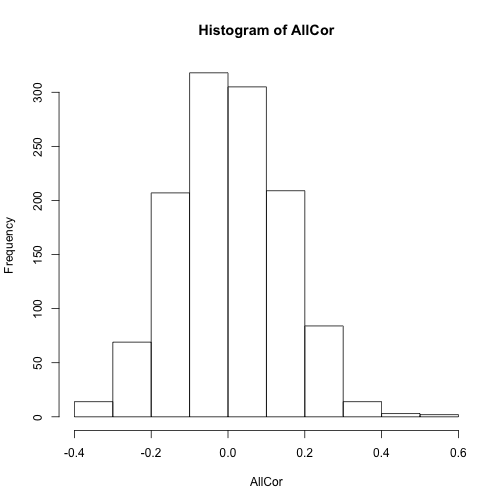

Similarity problems and MINERVA
-------------------------------

1. Create a prototype (50 units)
2. Create unique exmplars with some distortion from prototype


```r
library(lsa)
```

```
## Loading required package: Snowball
## Loading required package: RWeka
```

```r
getEcho2<-function(probe,mem) {
  simvals<-c()                                              # vector of similarities between probe and memory traces
  for(j in 1:dim(mem)[1]){                                  # Compute Similarities
    simvals[j]<-cosine(probe[1:50],mem[j,1:50])
  }
  echomat<-abs(mem)*(simvals^3)                             # Multiply memory traces by activation value
  echomat[echomat==Inf]<-0                                  # Set any Inf numbers to zero
  echo<-colSums(echomat*sign(mem))      # Sum memory traces, add noise
  echo<-echo/max(abs(echo))                                 # Normalize Echo
  return(echo)
}

Prototype<-rbinom(50,1,.5)
Prototype[Prototype==0]<--1

Exemplars<-matrix(ncol=50,nrow=0)
#Create unique sampling distortions
SamplingDistortion<-matrix(ncol=10,nrow=0)
for(i in 1:100){
SamplingDistortion<-rbind(SamplingDistortion,sort(sample(seq(1:50),10,replace=F)))
}
SamplingDistortion<-unique(SamplingDistortion)
a<-0
for(i in 1:50){
  a<-a+1
  ones<-rep(1,50)
  ones[SamplingDistortion[a,]]<--1
  temp<-Prototype
  Exemplars<-rbind(Exemplars,temp*ones)
}
Memory<-Exemplars
Self<-c()
Proto<-c()
Original<-c()
SelfAll<-c()
SelfOriginal<-c()
for(i in 1:50){
Self<-c(Self,cor(getEcho2(Exemplars[i,],Memory),Exemplars[i,]))
Proto<-c(Proto,cor(getEcho2(Exemplars[i,],Memory),Prototype))
Original<-c(Original,cor(Exemplars[i,],Prototype))
SelfAll<-c(SelfAll,mean(cor(getEcho2(Exemplars[i,],Memory),t(Memory))))
SelfOriginal<-c(SelfOriginal,mean(cor(Exemplars[i,],t(Memory))))
}

c(mean(Self),mean(Proto),mean(Original),mean(SelfAll),mean(SelfOriginal))
```

```
## [1] 0.8706999 0.8970623 0.5989945 0.5550659 0.3701004
```
The above means show three similarity values. The first is the similarity between a probe for an exemplar in memory and it's echo. The second is the similarity between the retrieved echo from above and the prototype. The third is the similarity between the original cue and the prototype. All of these similarities are computed as averages over the 50 exemplars in memory. The fourth is the similarity between the echo for a given exemplar and all exemplars in memory. The fifth is the similarity between the Exemplar and all Exemplars in Memory.

```r
#average correlation between each exemplar
AllCor<-cor(t(Memory))
AllCorTri<-upper.tri(AllCor,diag=TRUE)
AllCor[AllCorTri]<-NA
mean(AllCor,na.rm=TRUE)
```

```
## [1] 0.3572453
```

```r
hist(AllCor)
```

 

1. Create a prototype (50 units)
2. Create unique random exemplars with no specific relation to prototype


```r
Prototype<-rbinom(50,1,.5)
Prototype[Prototype==0]<--1
Exemplars<-rbinom(50*50,1,.5)
Exemplars[Exemplars==0]<--1
Memory<-matrix(Exemplars,ncol=50)
Exemplars<-Memory

Self<-c()
Proto<-c()
Original<-c()
SelfAll<-c()
SelfOriginal<-c()
for(i in 1:50){
Self<-c(Self,cor(getEcho2(Exemplars[i,],Memory),Exemplars[i,]))
Proto<-c(Proto,cor(getEcho2(Exemplars[i,],Memory),Prototype))
Original<-c(Original,cor(Exemplars[i,],Prototype))
SelfAll<-c(SelfAll,mean(cor(getEcho2(Exemplars[i,],Memory),t(Memory))))
SelfOriginal<-c(SelfOriginal,mean(cor(Exemplars[i,],t(Memory))))
}

c(mean(Self),mean(Proto),mean(Original),mean(SelfAll),mean(SelfOriginal))
```

```
## [1]  0.99790863 -0.03871328 -0.03592183  0.02589560  0.02493530
```


```r
#average correlation between each exemplar
AllCor<-cor(t(Memory))
AllCorTri<-upper.tri(AllCor,diag=TRUE)
AllCor[AllCorTri]<-NA
mean(AllCor,na.rm=TRUE)
```

```
## [1] 0.005036022
```

```r
hist(AllCor)
```

 

## Results of the 2 simulations

### Retrieval of specific exemplars
The above two simulations show that the similarity structure between exemplars in memory influences retrieval success. In the first simulation, when the exemplars were distortions of a prototype, the ability to retrieve a single exemplar was worse than in the second simulation, where the exemplars were drawn from a random distribution. 

### Echo and prototypes
The first simulation shows that a retrieved echo for a given exemplar probe is more similar to the prototype than is the probe for the exemplar itself. The process of creating the exemplar molds it into the shape of the other items in memory, which in this case all resemble a particular prototype.

### Echoes and other exemplars
The first simulation shows that the average similarity between exemplars is lower before memory retrieval. When similarity between exemplars is computed on the basis of an echo generated by using each exemplar as a probe, mean similarity increases.

# Storing echoes and memory degradation

MINERVA's retrieval process sums across evidence in memory weighted by the similarity of the items in memory to the probe. If the echo is stored on each retrieval attempt as a new memory, then the similarity structure of the memory should move toward a single pattern. Thus, according to the model, the act of remembering should "clutter" memory with new reconstructions that blend together prior memories, and shift the total memory space toward each exemplar becoming more similar to each other.


```r
Prototype<-rbinom(50,1,.5)
Prototype[Prototype==0]<--1

Exemplars<-matrix(ncol=50,nrow=0)
#Create unique sampling distortions
SamplingDistortion<-matrix(ncol=10,nrow=0)
for(i in 1:100){
SamplingDistortion<-rbind(SamplingDistortion,sort(sample(seq(1:50),10,replace=F)))
}
SamplingDistortion<-unique(SamplingDistortion)
a<-0
for(i in 1:50){
  a<-a+1
  ones<-rep(1,50)
  ones[SamplingDistortion[a,]]<--1
  temp<-Prototype
  Exemplars<-rbind(Exemplars,temp*ones)
}
Memory<-Exemplars
Self<-c()
Proto<-c()
Original<-c()
SelfAll<-c()
SelfOriginal<-c()
for(i in 1:50){
Self<-c(Self,cor(getEcho2(Exemplars[i,],Memory),Exemplars[i,]))
Proto<-c(Proto,cor(getEcho2(Exemplars[i,],Memory),Prototype))
Original<-c(Original,cor(Exemplars[i,],Prototype))
SelfAll<-c(SelfAll,mean(cor(getEcho2(Exemplars[i,],Memory),t(Memory))))
SelfOriginal<-c(SelfOriginal,mean(cor(Exemplars[i,],t(Memory))))
}

c(mean(Self),mean(Proto),mean(Original),mean(SelfAll),mean(SelfOriginal))
```

```
## [1] 0.8664973 0.8959999 0.6003347 0.5635339 0.3766603
```

```r
for(i in 1:50){
  Memory<-rbind(Memory,getEcho2(Exemplars[i,],Memory))
}

Self<-c()
Proto<-c()
Original<-c()
SelfAll<-c()
SelfOriginal<-c()
for(i in 1:50){
Self<-c(Self,cor(getEcho2(Exemplars[i,],Memory),Exemplars[i,]))
Proto<-c(Proto,cor(getEcho2(Exemplars[i,],Memory),Prototype))
Original<-c(Original,cor(Exemplars[i,],Prototype))
SelfAll<-c(SelfAll,mean(cor(getEcho2(Exemplars[i,],Memory),t(Memory))))
SelfOriginal<-c(SelfOriginal,mean(cor(Exemplars[i,],t(Memory))))
}

c(mean(Self),mean(Proto),mean(Original),mean(SelfAll),mean(SelfOriginal))
```

```
## [1] 0.6929361 0.9724898 0.6003347 0.7890566 0.4870622
```

```r
for(j in 1:10){
for(i in 1:50){
  Memory<-rbind(Memory,getEcho2(Exemplars[i,],Memory))
}
}

Self<-c()
Proto<-c()
Original<-c()
SelfAll<-c()
SelfOriginal<-c()
for(i in 1:50){
Self<-c(Self,cor(getEcho2(Exemplars[i,],Memory),Exemplars[i,]))
Proto<-c(Proto,cor(getEcho2(Exemplars[i,],Memory),Prototype))
Original<-c(Original,cor(Exemplars[i,],Prototype))
SelfAll<-c(SelfAll,mean(cor(getEcho2(Exemplars[i,],Memory),t(Memory))))
SelfOriginal<-c(SelfOriginal,mean(cor(Exemplars[i,],t(Memory))))
}

c(mean(Self),mean(Proto),mean(Original),mean(SelfAll),mean(SelfOriginal))
```

```
## [1] 0.6222443 0.9786097 0.6003347 0.9650058 0.5919249
```

